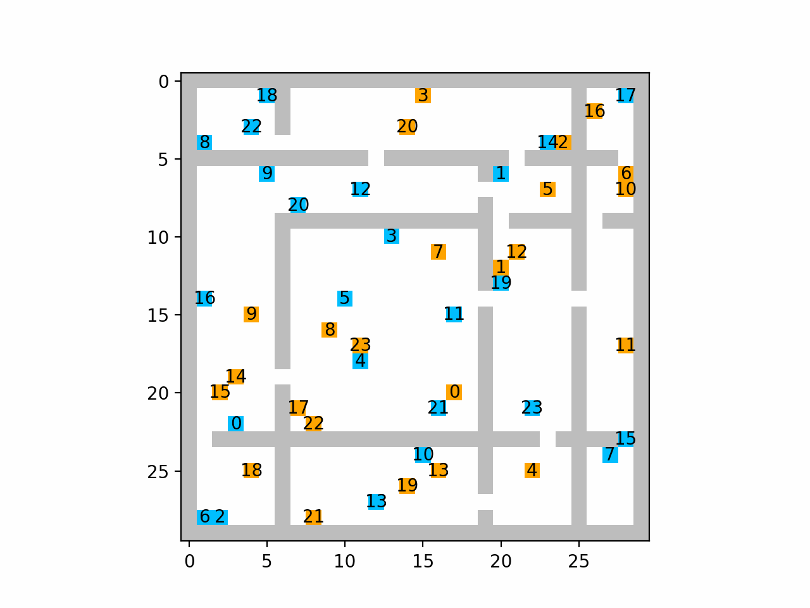
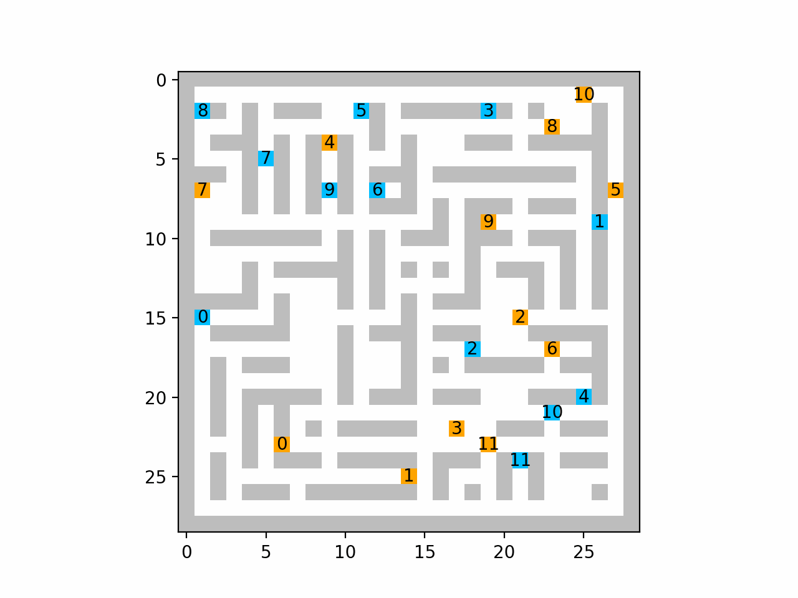
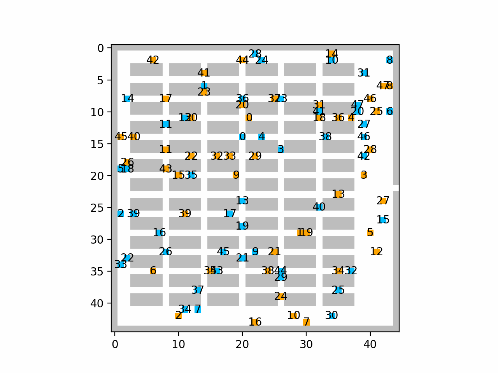
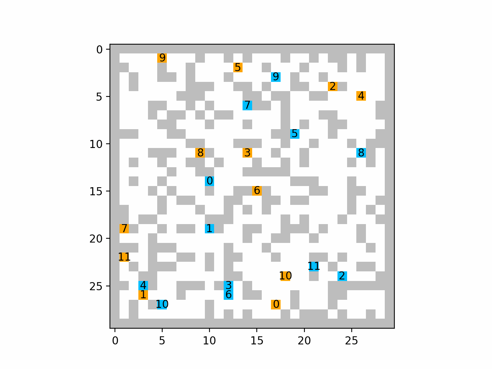

# SIGMA-MQL: Meta-Q Learning for Cross-Task Generalization in Multi-Agent Pathfinding
[](https://pytorch.org/)
[](https://opensource.org/licenses/MIT)

This repository extends [SIGMA](https://arxiv.org/abs/2502.06440) (Sheaf-Informed Geometric Multi-Agent Pathfinding) with a Meta-Q Learning (MQL) training and adaptation procedure to improve cross-task generalization in decentralized multi-agent path finding (MAPF).

<p align="center">
  
  
  
  
</p>
<p align="center">
  <em>Room</em> &nbsp;&nbsp;&nbsp;&nbsp;&nbsp;&nbsp;&nbsp;&nbsp;&nbsp;&nbsp;&nbsp;&nbsp;&nbsp;&nbsp;&nbsp;&nbsp;&nbsp;&nbsp;&nbsp;&nbsp;&nbsp;&nbsp;&nbsp;&nbsp;&nbsp;&nbsp;&nbsp;&nbsp;&nbsp;&nbsp;&nbsp;&nbsp;
  <em>Maze</em> &nbsp;&nbsp;&nbsp;&nbsp;&nbsp;&nbsp;&nbsp;&nbsp;&nbsp;&nbsp;&nbsp;&nbsp;&nbsp;&nbsp;&nbsp;&nbsp;&nbsp;&nbsp;&nbsp;&nbsp;&nbsp;&nbsp;&nbsp;&nbsp;&nbsp;&nbsp;&nbsp;&nbsp;&nbsp;&nbsp;&nbsp;&nbsp;
  <em>Warehouse</em> &nbsp;&nbsp;&nbsp;&nbsp;&nbsp;&nbsp;&nbsp;&nbsp;&nbsp;&nbsp;&nbsp;&nbsp;&nbsp;&nbsp;&nbsp;&nbsp;&nbsp;&nbsp;&nbsp;&nbsp;&nbsp;&nbsp;&nbsp;&nbsp;&nbsp;&nbsp;
  <em>Random</em>
</p>


## Overview

We study cross-task generalization in grid-based MAPF with decentralized deep Q-learning. Starting from SIGMA—a sheaf-regularized DQN that encourages local-to-global consensus among agents—we add a Meta-Q Learning (MQL) style training and adaptation procedure.

**Key contributions:**
- Evaluation of four training paradigms (single-task, multi-task, meta-learning variants) across multiple MAPF "tasks" (map generators)
- Analysis of success rate, makespan, and few-shot adaptation curves on held-out task transfers
- Demonstration that combining explicit coordination structure (sheaf regularization) with meta-RL adaptation improves robustness to distribution shift in cooperative planning

## Requirements
```bash
conda create -n sigma python==3.10
conda activate sigma
pip install numpy==1.23.5
# CUDA 11.8
pip install torch==2.0.0 torchvision==0.15.1 torchaudio==2.0.1 --index-url https://download.pytorch.org/whl/cu118
pip install -r requirements.txt
```

## Project Structure
```
.
├── configs.py        # Base configuration parameters
├── meta_configs.py   # Meta-learning configuration
├── model.py          # Core SIGMA network architecture
├── meta_model.py     # Meta-Q Learning model extensions
├── train.py          # Standard distributed training
├── train_meta.py     # Meta-learning training entry
├── eval_meta.py      # Meta-learning evaluation
├── test.py           # Evaluation and visualization
├── environment.py    # Multi-agent simulation environment
├── map_generator.py  # Task/map generation utilities
├── buffer.py         # Experience replay buffer
└── worker.py         # Ray parallelization components
```

## Environment Types (Tasks)

SIGMA-MQL supports multiple environment types as distinct "tasks" for meta-learning:
1. **Room-like Environment**: Open spaces with obstacles simulating indoor scenarios
2. **Maze Environment**: Complex corridor structures with multiple pathways
3. **Warehouse Environment**: Grid layouts with aisles and shelving units typical of logistics settings
4. **Random Obstacles**: Procedurally generated obstacle configurations

Cross-task generalization is evaluated by training on a subset of tasks and adapting to held-out tasks with few-shot learning.

## Experimental Setup

**Base Configuration:** 15×15 grid, 3 agents, 0.3 obstacle density, 512 episode horizon, using the same reward function as SIGMA.

**Training Paradigms:** We compare four approaches under comparable compute budgets:

| Paradigm | Description |
|----------|-------------|
| **Single-Task (SIGMA)** | Train separate models on each task; isolates cross-task transfer without multi-task exposure |
| **Multi-Task (MT-SIGMA)** | Train one model sampling tasks uniformly per episode; produces an "averaged" policy |
| **Transfer + Finetune (SIGMA+FT)** | Pretrain on source task, finetune on target for *n* updates |
| **Meta-Q Learning (SIGMA-MQL)** | Meta-train on all tasks, adapt to test tasks with few-shot off-policy TD updates |

Generalization is evaluated by training on one (or many) tasks and testing on all tasks, measuring success rate, makespan, and arrival rate metrics.

## Training

```bash
# Standard single-task training
python train.py

# Meta-learning training
python train_meta.py
```

## Evaluation

```bash
# Evaluate meta-learned model with few-shot adaptation
python eval_meta.py

# Standard evaluation
python test.py
```

## Acknowledgments

This project builds upon [SIGMA](https://github.com/marmotlab/SIGMA) (Sheaf-Informed Geometric Multi-Agent Pathfinding), accepted for oral presentation at ICRA 2025. We thank the original authors for their foundational work.

## Citation

If you use this work, please cite the original SIGMA paper:
```bibtex
@INPROCEEDINGS{11127434,
  author={Liao, Shuhao and Xia, Weihang and Cao, Yuhong and Dai, Weiheng and He, Chengyang and Wu, Wenjun and Sartoretti, Guillaume},
  booktitle={2025 IEEE International Conference on Robotics and Automation (ICRA)}, 
  title={SIGMA: Sheaf-Informed Geometric Multi-Agent Pathfinding}, 
  year={2025},
  volume={},
  number={},
  pages={1-7},
  keywords={Neural networks;Decision making;Transportation;Self-supervised learning;Deep reinforcement learning;Loss measurement;Mathematical models;Collision avoidance;Robots;Logistics},
  doi={10.1109/ICRA55743.2025.11127434}}
```

## License

This project is licensed under the MIT License - see the [LICENSE](LICENSE) file for details.
